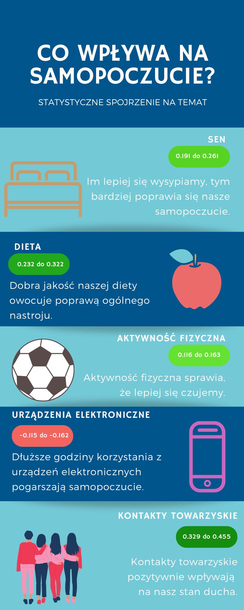

```{r setup, include=FALSE, results='asis'}
knitr::opts_chunk$set(echo = F,
                      message = F,
                      warning = F,
                      dev = "cairo_pdf")
```

```{r biblioteki}
library(alr3)
library(kableExtra)
library(magrittr)
library(plyr)
library(tidyverse)
library(lmtest)
library(ggplot2)
library(ggcorrplot)
library(ggpubr)
library(stargazer)
library(tables)
library(Hmisc)
library(tinytex)
library(plotly)
library(plotrix)

colf <- colorRampPalette(c("white","royalblue"))
```


\newpage 

# Wstęp

Celem naszego projektu jest analiza statystyczna wpływu różnych czynników na poziom samopoczucia. Zbadamy wpływ na odczuwanie poszczególnych emocji czynników z pięciu grup: dotyczących snu, diety, aktywności fizycznej, kontaktów towarzyskich oraz używania urządzeń elektronicznych. Sprawdzimy, czy średnie samopoczucie różni się pomiędzy płciami oraz pomiędzy różnymi grupami wiekowymi.

# Opis danych

## Zbieranie danych, opis badanej grupy

Dane zebraliśmy na podstawie ankiety. Pytania dotyczące emocji pochodzą z artykułu "Skale do Pomiaru Nastroju i Sześciu Emocji" autorstwa Bogdana Wojciszke i Wiesława Baryły. Pozostałe pytania są naszego autorstwa. Ankietę stworzyliśmy za pomocą Formularzy Google i rozesłaliśmy respondentom drogą internetową.

Przebadana przez nas grupa składała się z 240 osób. Spośród nich 48.3% było kobietami, a 51.7% było mężczyznami. Większość osób (trochę ponad połowa) było w wieku co najwyżej 23 lat (w tym aż 30% w wieku 21 lat).

Pierwsze 10 pytań były to zdania dotyczące aktualnego samopoczucia. Należało ocenić w skali od 1 do 5, jak bardzo zgadzasz się z danym twierdzeniem. Po nich następowały 24 uczucia takie jak radość, złość, depresja itp. Należało ocenić w skali od 1 do 7 (od "nigdy" do "zawsze") jak często odczuwasz daną emocję.

Potem pojawiały się pytania o czynniki, których wpływ na samopoczucie chcemy zbadać. Każdego z pięciu poniższych czynników dotyczyły trzy pytania:

- sen: liczba godzin przespanych w ciągu doby (do wyboru z 5 odpowiedzi), posiadanie wyznaczonych godzin snu (ocena w skali od 1 do 5), jakość snu (ocena w skali od 1 do 5)

- aktywność fizyczna: ilość godzin poświęcana tygodniowo na sport (do wyboru z 5 odpowiedzi), najczęściej wybierany środek transportu (do wyboru z 5 odpowiedzi, w tym możliwość podania własnej odpowiedzi przy opcji "inne"), kondycja fizyczna (ocena w skali od 1 do 5)

- używanie urządzeń elektronicznych: ilość godzin spędzana w ciągu dnia na korzystaniu z urządzeń elektronicznych w celu pracy/nauki (do wyboru z 5 odpowiedzi), ilość godzin spędzana w ciągu dnia na korzystaniu z urządzeń elektronicznych w celu rozrywki (do wyboru z 5 odpowiedzi), poczucie uzależnienia od urządzeń elektronicznych (ocena w skali od 1 do 5)

- dieta: przeważający składnik w diecie (do wyboru z 5 odpowiedzi), znaczenie jakości posiłków (do wyboru z 5 odpowiedzi), regularność posiłków (do wyboru z 5 odpowiedzi)

- kontakty towarzyskie: posiadanie bliskich osób, na których można polegać (do wyboru z 5 odpowiedzi), liczba bliższych znajomych (do wyboru z 5 odpowiedzi), znaczenie kontaktów z innymi ludźmi (ocena w skali od 1 do 5)

Jak widać, wszystkie te czynniki były oceniane w skali od 1 do 5, a czynniki dotyczące samopoczucia bądź w skali od 1 do 7, bądź w skali od 1 do 5. Zbadamy zarówno zależności pomiędzy pojedynczymi czynnikami, jak również pomiędzy zsumowanymi, na przykład Ogólna ocena samopoczucia.

## Import i oczyszczanie danych

Do R zaimportowaliśmy dane z pliku `.xlsx`. Przy tworzeniu ankiety zastrzegliśmy, że na każde pytanie trzeba odpowiedzieć, dlatego nie mieliśmy problemu z brakami danych. W kolumnie `wiek` mieliśmy kilka nieprawidłowo wprowadzonych danych, większość osób podawała wiek jako liczbę, ale niektórzy pisali np. "21 lat". Poprawiliśmy to i zmieniliśmy typ kolumny na numeryczny. Musieliśmy też poprawić kilka odpowiedzi na pytanie o jakość posiłków, ponieważ zmieniliśmy jedną z możliwych odpowiedzi w ankiecie już po rozpoczęciu zbierania danych.

Wszystkim kolumnom zmieniliśmy nazwy, tak aby pozbyć się polskich znaków i odstępów, oraz żeby ułatwić sobie pracę z danymi.

Typ danych w kolumnach, w których możliwych było 5 odpowiedzi na pytanie, zmieniliśmy na `factor`, i uszeregowaliśmy od odpowiedzi, która według nas w danym pytaniu była najgorsza, do najlepszej.

W pytaniach, gdzie należało oceniać czynnik w skali od 1 do 5 lub od 1 do 7, także zmieniliśmy typ na `factor`.

Dodaliśmy także kolumnę z Ogólną oceną samopoczucia, w której zsumowaliśmy odpowiedzi z pytań o emocje - pozytywne uczucia sumowaliśmy z plusem, a negatywne z minusem.

Te działania zostały wykonane w skrypcie `oczyszczanie_danych.R`, który załączymy do niniejszego raportu. Na koniec zapisaliśmy dane do pliku `dane.RData`.

```{r wczytanie danych}
load("dane.RData")
```

## Zbiorcza tabelka

```{r podsumowanie danych}
mindane <- NULL
maxdane <- NULL
mediadane <- NULL
srdane <- NULL
sddane <- NULL
normalnosc <- rep(0, ncol(dane)-1)
shapiro <- NULL
#zaczynamy od drugiej kolumny bo pierwsza to płeć
for( i in 2:ncol(dane)){
  mindane <- c(mindane,min(as.numeric(dane[, i]))) 
  maxdane <- c(maxdane,max(as.numeric(dane[, i])))
  mediadane <- c(mediadane,median(as.numeric(dane[, i])))
  srdane <- c(srdane, round(mean(as.numeric(dane[,i])),2))
  sddane <- c(sddane, sprintf("%.2f",sd(as.numeric(dane[,i]))))
  shapiro <- c(shapiro, shapiro.test(as.numeric(dane[, i]))$p.value)
}
for (i in 1:length(shapiro)){
  if(shapiro[i] <=0.05) {normalnosc[i] <- "tak"} else if (shapiro[i]<=0.1) {
    normalnosc[i] <- "decyzja niejednoznaczna" }else 
      normalnosc [i] <- "nie"
}


labelki <- c( "Wiek", "Jestem w złym humorze", "Czuję się świetnie",
         "Jestem w złym nastroju", "Czuję się rozluźniony i spokojny", 
         "Czuję się szaro i beznadziejnie",
         "Jestem w dobrym humorze",
         "Jestem pogodny", "Czuję się przygnębiony", 
         "Moje samopoczucie jest złe", 
         "Moje samopoczucie jest dobre",
         "Radość", "Niepokój", "Strach", "Miłość", "Gniew",
         "Wesołość", "Upokorzenie", "Smutek", "Wzburzenie", 
         "Lęk", "Żal", "Obawa", "Złość", "Załamanie", 
         "Szczęście", "Wściekłość", "Oddanie", "Zadowolenie",
         "Czułość", "Wstyd", "Poczucie winy", "Przywiązanie", 
         "Depresja", "Nieszczęście", 
         "Liczba godzin przespanych w ciągu doby",
         "Posiadanie wyznaczonych pór snu", 
         "Jakość snu", 
         "Godziny poświęcane tygodniowo na sport",
         "Najczęściej wybierany środek transportu", 
         "Ocena kondycji fizycznej", 
         "Godziny spędzone dziennie na pracy na urządzeniach elektronicznych",
         "Godziny spędzone dziennie na rozrywce na urządzeniach elektronicznych",
         "Poczucie uzależnienia od urządzeń elektronicznych",
         "Przeważający składnik w diecie", 
         "Dbanie o jakość posiłków", 
         "Regularność posiłków", 
         "Posiadanie zaufanej osoby", 
         "Liczba osób, z którymi utrzymuje się bliski konatkt",
         "Jakie znaczenie mają dla Ciebie kontakty z innymi ludźmi?",  
         "Ogólna ocena samopoczucia")
```

```{r tabelka}
tabela_cala <- cbind(labelki,mindane, mediadane,srdane, sddane, maxdane, normalnosc)
#tabela_cala <- as.tabular(tabela_cala)
tabela_cala1 <- tabela_cala[1,]
tabela_cala2 <- tabela_cala[2:11,]
tabela_cala3 <- tabela_cala[12:35,]
tabela_cala4 <- tabela_cala[36:38,]
tabela_cala5 <- tabela_cala[39:41,]
tabela_cala6 <- tabela_cala[42:44,]
tabela_cala7 <- tabela_cala[45:47,]
tabela_cala8 <- tabela_cala[48:51,]
```

```{r tabelka cała 1 kable, results='asis'}
#kable(tabela_cala1, booktabs = T, col.names = c("Cecha", "Minimum", "Mediana","Średnia", "Maksimum", "Czy rozkład istotnie różni się od rozkładu normalnego?")) %>%
#   kable_styling(full_width = TRUE, latex_options = c("striped", "scale_down"))
```

Pytania dotyczące aktualnego nastroju były oceniane 5-cio stopniową skalą. Wartości 1-5 oznaczały odpowiednio: "1 - nie zgadzam się", "2 - raczej się nie zgadzam", "3 - trochę tak, trochę nie", "4 - raczej się zgadzam", "5 - zgadzam się".

```{r tabelka cała 2 kable, results='asis'}
kable(tabela_cala2, booktabs = T, col.names = c("Cecha", "Minimum", "Mediana","Średnia", "Odchylenie standardowe", "Maksimum", "Czy rozkład różni się istotnie od rozkładu normalnego?")) %>%
   kable_styling(full_width = TRUE, latex_options = c("striped", "scale_down"),bootstrap_options = c("striped"))
```

Przy ocenie częstości odczuwania poszczególnych emocji, do wyboru były odpowiedzi oceniane w skali 7-mio stopniowej. Oznaczały odpowiednio: "1 - nigdy", "2 - bardzo rzadko", "3 - rzadko", "4 - czasami", "5 - często", "6 - bardzo często", "7 - zawsze".

```{r tabelka cała 3 kable, results='asis'}
kable(tabela_cala3, booktabs = T, col.names = c("Cecha", "Minimum", "Mediana","Średnia", "Odchylenie standardowe", "Maksimum", "Czy rozkład różni się istotnie od rozkładu normalnego?")) %>%
   kable_styling(full_width = TRUE, latex_options = c("striped", "scale_down"), bootstrap_options = c("striped"))
```

Pytania dotyczące snu oceniane były w skali 5-cio stopniowej. Wartości w pytaniu dotyczącym:

- średniej liczby przesypianych godzin oznaczały: "1 - mniej niż 4", "2 - 4-6h", "3 - 6-8h", "4 - 8-10h", "5 - więcej niż 10h";
- posiadania wyznaczonych pór snu określały: "1 - posiadanie regularnych pór snu" do "5 - posiadanie nieregularnych pór snu";
- oceny jakości snu określały: "1 - bardzo zła jakość" do "5 - bardzo dobra jakość".

```{r tabelka cała 4 kable, results='asis'}
kable(tabela_cala4, booktabs = T, col.names = c("Cecha", "Minimum", "Mediana","Średnia", "Odchylenie standardowe", "Maksimum", "Czy rozkład różni się istotnie od rozkładu normalnego?")) %>%
   kable_styling(full_width = TRUE, latex_options = c("striped", "scale_down"),bootstrap_options = c("striped"))
```

Pytania dotyczące sportu oceniane były w skali 5-cio stopniowej. Wartości w pytaniu dotyczącym:

- liczby godzin poświęconych tygodniowo na sport oznaczały: "1 - nie uprawiam żadnego sportu", "2 - mniej niż 1h", "3 - 1-2,5h", "4 - 2,5-4h", "5 - więcej niż 4h";
- najczęściej wybieranego środka transportu oznaczały: "1 - samochód", "2 - komunikacja miejska", "3 - rower", "4 - chodzenie pieszo", "5 - inny";
- oceny własnej kondyncji fizycznej określały: "1 - bardzo zła" do "5 - bardzo dobra".

```{r tabelka cała 5 kable, results='asis'}
kable(tabela_cala5, booktabs = T, col.names = c("Cecha", "Minimum", "Mediana","Średnia", "Odchylenie standardowe", "Maksimum", "Czy rozkład różni się istotnie od rozkładu normalnego?")) %>%
   kable_styling(full_width = TRUE, latex_options = c("striped", "scale_down"),bootstrap_options = c("striped"))
```

Pytania dotyczące korzystania z urządzeń elektronicznych oceniane były w skali 5-cio stopniowej. Wartości w pytaniu dotyczącym:

- średniej liczby godzin poświęcanej w ciągu dnia na korzystanie z u.e. w celu pracy bądź nauki oznaczały: "1 - nie używam/rzadko używam komputera do pracy/nauki", "2 - mniej niż 3", "3 - 3-5h", "4 - 5-8h", "5 - powyżej 5h";
- średniej liczby godzin poświęconej w ciągu dnia na korzystanie z u.e w celach rozrywkowych oznaczały:
"1 - mniej niż 1h", "2 - 1-2h", "3 - 2-3h", "4 - 3-4h", "5 - więcej niż 4h";
- częstości występowania poczucia uzależnienia od u.e. oznaczały: "1 - nigdy", "2 - rzadko", "3 - czasami", "4 - często", "5 - bardzo często".

```{r tabelka cała 6 kable, results='asis'}
kable(tabela_cala6, booktabs = T, col.names = c("Cecha", "Minimum", "Mediana","Średnia", "Odchylenie standardowe", "Maksimum","Czy rozkład różni się istotnie od rozkładu normalnego?")) %>%
   kable_styling(full_width = TRUE, latex_options = c("striped", "scale_down"), bootstrap_options = c("striped"))
```

Pytania dotyczące diety oceniane były w skali 5-cio stopniowej. Wartości w pytaniu dotyczącym:

- przeważającego składnika diety oznaczały: "1 - fast food", "2 - żywność mocno przetworzona (mrożonki, gotowe dania)", "3 - mięso i ciężkostrawne potrawy", "4 - warzywa i owoce", "5 - mam zbilansowaną dietę";
- wagi przywiązywanej do jakości spożywanych posiłków oznaczały: "1 - wszystko mi jedno", "2 - nie jest to moim priorytetem", "3 - staram się jeść zdrowo, ale mi nie wychodzi", "4 - jest to dla mnie dość ważne", "5 - jestem tym, co jem!";
- regularności spożywanych posiłków oznaczały: "1 - jem nieregularnie", "2 - różnie z tym bywa", "3 - staram się jeść regularnie", "4 - zazwyczaj jem regularnie", "5 - mam stałe pory posiłków".

```{r tabelka cała 7 kable, results='asis'}
kable(tabela_cala7, booktabs = T, col.names = c("Cecha", "Minimum", "Mediana","Średnia", "Odchylenie standardowe", "Maksimum", "Czy rozkład różni się istotnie od rozkładu normalnego?")) %>%
   kable_styling(full_width = TRUE, latex_options = c("striped", "scale_down"),bootstrap_options = c("striped"))
```

Pytania dotyczące kontaktów towarzyskich oceniane były w skali 5-cio stopniowej. Wartości w pytaniu dotyczącym:

- posiadania osoby, na której można polegać w trudnej sytuacji oznaczały: "1 - nie mam nikogo takiego", "2 - z rodziną/znajomymi nie poruszam poważnych tematów", "3 - nie czuję się komfortowo rozmawiając na trudne tematy z rodziną/znajomymi", "4 - na ogół mam do kogo zwrócić się z problemem", "5 - mam osoby, z którymi mogę porozmawiać o wszystkim";
- liczby osób, z którymi utrzymuje się stały kontakt oznaczały: "1 - brak takiej osoby", "2 - jedną osobę", "3 - 2-3 osoby", "4 - 4-5 osób", "5 - 5 i więcej osób";
- znaczenia, jakie mają dla ankietowanego kontakty z innymi ludźmi oznaczały "1 - brak znaczenia" do "5 - bardzo duże znaczenie".

```{r tabelka cała 8 kable, results='asis'}
kable(tabela_cala8, booktabs = T, col.names = c("Cecha", "Minimum", "Mediana","Średnia", "Odchylenie standardowe", "Maksimum", "Czy rozkład różni się istotnie od rozkładu normalnego?")) %>%
   kable_styling(full_width = TRUE, latex_options = c("striped", "scale_down"),bootstrap_options = c("striped"))
```

Ogólna ocena samopoczucia została uzyskana poprzez zsumowanie wartości uczuć pozytywnych ze znakiem dodatnim oraz negatywnych z ujemnym. 

# Hipotezy badawcze oraz ich weryfikacja


$H_0:$ nie istnieje zależność pomiędzy zmiennymi.

$H_1:$ istnieje zależność pomiędzy zmiennymi.

Hipotezy badane są na poziomie istotności $\alpha = 0.05$.

## Hipoteza I

Badanie, czy istnieje zależność pomiędzy poczuciem upokorzenia a jakością snu.

```{r hipoteza 1 testy}
r1 <- cor.test(x = as.numeric(dane$jakosc_snu), y = as.numeric(dane$upokorzenie),
         method = "spearman")$p.value
wsp_kor1 <- cor.test(x = as.numeric(dane$jakosc_snu), y = as.numeric(dane$upokorzenie),
         method = "spearman")$estimate
r2 <- cor.test(x = as.numeric(dane$jakosc_snu), y = as.numeric(dane$upokorzenie),
         method = "kendall")$p.value
wsp_kor2 <- cor.test(x = as.numeric(dane$jakosc_snu), y = as.numeric(dane$upokorzenie),
         method = "kendall")$estimate
```


### Wykresy boxplot


```{r hipoteza 1 boxplot}
par(mfrow=c(1,2))
boxplot(as.numeric(dane$upokorzenie), main = "Poczucie upokorzenia",ylab = "poziomy")
boxplot(as.numeric(dane$jakosc_snu), main = "Jakość snu", ylab = "poziomy")
par(mfrow=c(1,1))
```

```{r}
upokorzenie <- tabela_cala[18,]
jakosc <- tabela_cala[38,]
minitab <- rbind(upokorzenie, jakosc)
rownames(minitab) <- NULL
```


```{r results='asis'}
kable(minitab, booktabs = T, col.names = c("Cecha", "Minimum", "Mediana","Średnia", "Odchylenie standardowe", "Maksimum", "Czy rozkład różni się istotnie od rozkładu normalnego?")) %>%
   kable_styling(full_width = TRUE, latex_options = c("striped", "scale_down"),bootstrap_options = c("striped"))
```

 Upokorzenie było oceniane w skali od 1 do 7 (odczuwanie od "nigdy" do "zawsze"). Jak widać z wykresu boxplot, większość respondentów nie odczuwa upokorzenia nigdy, lub odczuwa je bardzo rzadko lub rzadko, gdzie "bardzo rzadko" jest medianą. Pojawił się co najmniej jeden element odstajacy - osoby odczuwające upokorzenie zawsze.
 
 Jakość snu była oceniona w skali od 1 do 5 (od najgorszej do najlepszej). Jakość snu była oceniana głównie na 3 lub 4, gdzie 3 jest medianą. Pojawiały się elementy odstające - osoby, które oceniły swoją jakość snu na 1.

### Tabela kontygencji


```{r hipoteza 1 tabelka}
ttab <- prop.table(table(dane$upokorzenie, dane$jakosc_snu), margin = 2)*100
ttab_round <- round(ttab,2)
 tabelka <- tabular((Upokorzenie = dane$upokorzenie)~  Format(digits =2)*(`Jakość snu` = dane$jakosc_snu)*Heading()*Percent("col"))

```


```{r hipoteza 1 kable,  results = 'asis'}


 toKable(tabelka) %>%
   kable_styling(full_width = TRUE)

```

### Wykresy słupkowe

Poniżej przedstawiony wykres zawieraj wartości procentowe, nie liczebności dla poszczególnych odpowiedzi; podobnie jak w przypadku wykresów tego typu przedstawionych dla kolejnych hipotez.

```{r hipoteza 1 barplot}
par(mar=c(5.1, 4.1, 4.1, 5.2), xpd=TRUE)
bar <- barplot(ttab,
        main = "Odczuwanie upokorzenia w zależności od jakości snu",
        xlab="Jakość snu",
        ylab="Procentowy rozkład poczucia upokorzenia",
        col=colf(7),
        names.arg = c("bardzo zła", "kiepska", "przeciętna", "dobra", "bardzo dobra"))
legend("topright",
       inset=c(-0.2,0),
       title = "Częstość",
       legend = c("nigdy", "b.rzadko", "rzadko", "czasami", "często", "b.często", "zawsze"),
       fill = colf(7),
       cex=0.9)
barlabels(bar, ttab_round)
```

```{r}
tabela <- rbind()
```

### Wyniki testów


```{r results='asis'}
pvals <- c(wsp_kor1, r1, wsp_kor2, r2)
pvals <- round(pvals,3)
pvals <- rbind(c("współczynnik korelacji", "p-value", "współczynnik korelacji", "p-value"),pvals)
rownames(pvals) <- c("","")
colnames(pvals) <- c("test rho-Spearmana","", "test tau-Kendalla", "")
kable(pvals)%>%
  kable_styling(full_width = T)

```

P-value dla testu `rho-Spearmana` wynosi $p =$ `r sprintf("%.3f", r1)`, natomiast dla testu `tau-Kendalla` wynosi $p =$ `r sprintf("%.3f", r2)`. Nie ma podstaw do odrzucenia hipotezy $H_0$, a więc nie istnieje istotna zależność pomiędzy poczuciem upokorzenia a jakością snu. Współczynniki korelacji dla testów `rho-Spearmana` oraz `tau-Kendalla` wynoszą odpowiednio `r sprintf("%.5f", wsp_kor1)` oraz `r sprintf("%.5f", wsp_kor2)`, ale na poziomie istotności $\alpha = 0.05$ nie są istotne statystycznie.

## Hipoteza II

Badanie, czy istnieje zależność pomiędzy dietą a poczuciem radości.

```{r hipoteza 2 testy}
r3 <- cor.test(x = as.numeric(dane$dieta), y = as.numeric(dane$radosc),
         method = "spearman")$p.value
wsp_kor3 <- cor.test(x = as.numeric(dane$dieta), y = as.numeric(dane$radosc),
         method = "spearman")$estimate
r4 <- cor.test(x = as.numeric(dane$dieta), y = as.numeric(dane$radosc),
         method = "kendall")$p.value
wsp_kor4 <- cor.test(x = as.numeric(dane$dieta), y = as.numeric(dane$radosc),
         method = "kendall")$estimate
```


### Wykresy boxplot
```{r hipoteza 2 boxplot}
par(mfrow=c(1,2))
boxplot(as.numeric(dane$dieta), main = "Dieta",ylab = "poziomy")
boxplot(as.numeric(dane$radosc), main = "Poczucie radości", ylab = "poziomy")
par(mfrow=c(1,1))
```

```{r}
skladnik_diety <- tabela_cala[45,]
radosc <- tabela_cala[12,]
minitab <- rbind(skladnik_diety, radosc)
rownames(minitab) <- NULL
```


```{r results='asis'}
kable(minitab, booktabs = T, col.names = c("Cecha", "Minimum", "Mediana","Średnia", "Odchylenie standardowe", "Maksimum", "Czy rozkład różni się istotnie od rozkładu normalnego?")) %>%
   kable_styling(full_width = TRUE, latex_options = c("striped", "scale_down"),bootstrap_options = c("striped"))
```

Dieta (a właściwie jej przeważający składnik) była oceniana w skali od 1 do 5, z następujaco uszeregowanymi wartościami: 
- 1 - fast food

- 2 - żywność mrożona, produkty mocno przetworzone

- 3 - mięso i potrawy ciężkostrawne

- 4 - dieta wegetariańska

- 5 - dieta zbilansowana

Większość ocen wahała się od 3 do 5, gdzie 5 było medianą.

Odczuwanie radości było oceniane w skali od 1 do 7 ("nigdy" do "zawsze"). Oceny wahały się między 4 a 6, gdzie 5 jest medianą.


### Tabela kontygencji

```{r hipoteza 2 tabelka}
tabelka <- tabular((`Poczucie radości` = dane$radosc)~  Format(digits =2)*(`Jakość diety` = dane$dieta)*Heading()*Percent("col"))


```

```{r hipoteza 2 kable, results = 'asis'}


 toKable(tabelka) %>%
   kable_styling(full_width = TRUE)

```

### Wykresy słupkowe

```{r hipoteza 2 barplot}
par(mar=c(5.1, 4.1, 4.1, 5.2), xpd=TRUE)
ttab <- prop.table(table(dane$radosc, dane$dieta), margin = 2)*100
ttab_round <- round(ttab, 2)

bar <- barplot(ttab,
        main = "Odczuwanie radości, w zależności od rodzaju diety",
        xlab="Rodzaj diety",
        ylab="Procentowy rozkład poczucia radości",
        col=colf(7),
        names.arg = c("fast food", "przetworzona", "mięso","wegetariańska", "zbilans."))
legend("topright",
       inset=c(-0.2,0),
       title = "Częstość",
       legend = c("nigdy", "b.rzadko", "rzadko", "czasami", "często", "b.często", "zawsze"),
       fill = colf(7),
       cex=0.9)
barlabels(bar, ttab_round)
```

### Wyniki testów


```{r results='asis'}
pvals <- c(wsp_kor3, r3, wsp_kor4, r4)
pvals <- round(pvals,3)
pvals <- rbind(c("współczynnik korelacji", "p-value", "współczynnik korelacji", "p-value"),pvals)
rownames(pvals) <- c("","")
colnames(pvals) <- c("test rho-Spearmana","", "test tau-Kendalla", "")
kable(pvals)%>%
  kable_styling(full_width = T)

```

P-value dla testu `rho-Spearmana` wynosi $p =$ `r sprintf("%.3f", r3)`, natomiast dla testu `tau-Kendalla` wynosi $p =$ `r sprintf("%.3f", r4)`. Nie ma podstaw do odrzucenia $H_0$. Nie istnieje istotna zależność pomiędzy dietą a poczuciem radości.

## Hipoteza III

Badanie, czy istnieje zależność pomiędzy liczbą bliskich znajomych a odczuwaniem niepokoju.

```{r hipoteza 3 testy}
r5 <- cor.test(x = as.numeric(dane$liczba_osob_kontakty),
               y = as.numeric(dane$niepokoj),
               method = "spearman")$p.value
wsp_kor5 <- cor.test(x = as.numeric(dane$liczba_osob_kontakty),
               y = as.numeric(dane$niepokoj),
               method = "spearman")$estimate
r6 <- cor.test(x = as.numeric(dane$liczba_osob_kontakty),
               y = as.numeric(dane$niepokoj),
               method = "kendall")$p.value
wsp_kor6 <- cor.test(x = as.numeric(dane$liczba_osob_kontakty),
               y = as.numeric(dane$niepokoj),
               method = "kendall")$estimate
```

### Wykresy boxplot

```{r}

par(mfrow=c(1,2))
boxplot(as.numeric(dane$liczba_osob_kontakty), main = "Liczba bliskich znajomych",ylab = "poziomy")
boxplot(as.numeric(dane$niepokoj), main = "Poczucie niepokoju", ylab = "poziomy")
par(mfrow=c(1,1))
```

```{r}
znajomi <- tabela_cala[49,]
niepokoj <- tabela_cala[13,]
minitab <- rbind(znajomi, niepokoj)
rownames(minitab) <- NULL
```


```{r results='asis'}
kable(minitab, booktabs = T, col.names = c("Cecha", "Minimum", "Mediana","Średnia", "Odchylenie standardowe", "Maksimum", "Czy rozkład różni się istotnie od rozkładu normalnego?")) %>%
   kable_styling(full_width = TRUE, latex_options = c("striped", "scale_down"),bootstrap_options = c("striped"))
```

Liczba bliskich znajomych była oceniana od 1 do 5 z kolejnymi poziomami:

- 1 -brak bliskich znajomych

- 2 - 1 do 2 bliskich osób

- 3 - 2-3 takich osób

- 4 - 4-5 osób

- 5 - więcej niż 5 bliskich znajomych

Najwięcej ocen było pomiędzy 3 a 5, gdzie 4 jest medianą.

Poczucie niepokoju było oceniane w skali 1 do 7 ("nigdy" do "zawsze"). Najwięcej ocen było pomiędzy 3 a 5, gdzie 4 jest medianą.

### Tabela kontygencji

```{r hipoteza 3 tabelka}
tabelka <- tabular((`Niepokój` = dane$niepokoj)~  Format(digits =2)*(`Liczba bliskich znajomych` = dane$liczba_osob_kontakty)*Heading()*Percent("col"))


```

```{r hipoteza 3 kable,  results = 'asis'}


 toKable(tabelka) %>%
   kable_styling(full_width = TRUE)

```

### Wykresy słupkowe

```{r hipoteza 3 barplot}
par(mar=c(5.1, 4.1, 4.1, 5.2), xpd=TRUE)
ttab <- prop.table(table(dane$niepokoj, dane$liczba_osob_kontakty), margin = 2)*100
ttab_round <- round(ttab,2)

bar <- barplot(ttab,
        main = "Odczuwanie niepokoju, w zależności od liczby bliskich znajomych",
        xlab="Liczba osób, z którymi utrzymuje się regularny kontakt",
        ylab="Procentowy rozkład poczucia niepokoju",
        col=colf(7),
        names.arg = c("0", "1", "2-3","4-5", "więcej niż 5"))
legend("topright",
       inset=c(-0.2,0),
       title = "Częstość",
       legend = c("nigdy", "b.rzadko", "rzadko", "czasami", "często", "b.często", "zawsze"),
       fill = colf(7),
       cex=0.9)
barlabels(bar, ttab_round)
```

```{r hipoteza 3 korelacje}
wsp_kor5 <- cor.test(x = as.numeric(dane$liczba_osob_kontakty),
               y = as.numeric(dane$niepokoj),
               method = "spearman")$estimate
wsp_kor6 <- cor.test(x = as.numeric(dane$liczba_osob_kontakty),
               y = as.numeric(dane$niepokoj),
               method = "kendall")$estimate
```


### Wyniki testów

```{r results='asis'}
pvals <- c(wsp_kor5, r5, wsp_kor6, r6)
pvals <- round(pvals,3)
pvals <- rbind(c("współczynnik korelacji", "p-value", "współczynnik korelacji", "p-value"),pvals)
rownames(pvals) <- c("","")
colnames(pvals) <- c("test rho-Spearmana","", "test tau-Kendalla", "")
kable(pvals)%>%
  kable_styling(full_width = T)

```

P-value dla obu testów wynosi około $p =$ `r sprintf("%.3f", r5)`. Należy odrzucić hipotezę $H_0$, na rzecz hipotezy alternatywnej $H_1$. Istnieje zależność pomiędzy liczbą osób, z którymi utrzymuje się regularny kontakt a odczuwaniem niepokoju.

Współczynniki korelacji dla testów `rho-Spearmana` i `tau-Kendalla` wynoszą odpowiednio `r sprintf("%.3f",wsp_kor5)` oraz `r sprintf("%.3f",wsp_kor6)`. Interpretując te współczynniki oraz dane z wykresów, można stwierdzić, że wraz ze wzrostem liczby osób, z którymi utrzymuje się regularny kontakt, spada częstość odczuwania niepokoju.

### Bubble!

Ponieważ z testów wynika, że istnieje zależnośc pomiędzy tymi dwoma czynnikami, można również zobrazować ją wykresem `bubble chart`, uwzględniając podział na wiek i płeć.

```{r}
bombelki3 <- dane %>% 
  ggplot(aes(x =liczba_osob_kontakty, y = niepokoj, size = wiek, color = plec))+
  geom_point()
bombelki3
```

Z powyższego wykresu można wysnuć wniosek, że u mężczyzn brak posiadania stałych kontaktów z innymi ludźmi znacząco wpływa na częstość odczuwania niepokoju; gdy liczba kontaktów wzrasta, ta częstotliwość spada. Również wiek ma tutaj spore znaczenie.

U kobiet - szczególnie młodszych, niezależnie od liczby bliskich znajomych, odczuwanie niepokoju jest częstszym zjawiskiem (dlatego SWOJĄ kobietę trzeba dużo tulić).

## Hipoteza IV

Badanie, czy istnieje zależność pomiędzy liczbą godzin przeznaczonych na korzystanie z urządzeń elektronicznych a poczuciem uzależnienia od urządzeń.

```{r hipoteza 4 testy}
r7 <- cor.test(x = as.numeric(dane$godziny_rozrywki_urzadzenia),
               y = as.numeric(dane$poczucie_uzaleznienia_urzadzenia),
               method = "spearman")$p.value
r8 <- cor.test(x = as.numeric(dane$godziny_rozrywki_urzadzenia),
               y = as.numeric(dane$poczucie_uzaleznienia_urzadzenia),
               method = "kendall")$p.value
```

### Wykresy boxplot

```{r}

par(mfrow=c(1,2))
boxplot(as.numeric(dane$godziny_rozrywki_urzadzenia), main = "Liczba godzin spędzonych na \nkomputerze dla rozrywki",ylab = "poziomy")
boxplot(as.numeric(dane$poczucie_uzaleznienia_urzadzenia), main = "Poczucie uzależnienia \nod urządzeń", ylab = "poziomy")
par(mfrow=c(1,1))
```

```{r}
godziny_kompa <- tabela_cala[43,]
addicted <- tabela_cala[44,]
minitab <- rbind(upokorzenie, jakosc)
rownames(minitab) <- NULL
```


```{r results='asis'}
kable(minitab, booktabs = T, col.names = c("Cecha", "Minimum", "Mediana","Średnia", "Odchylenie standardowe", "Maksimum", "Czy rozkład różni się istotnie od rozkładu normalnego?")) %>%
   kable_styling(full_width = TRUE, latex_options = c("striped", "scale_down"),bootstrap_options = c("striped"))
```

Liczba godzin spędzonych na urządzeniach w celu rozrywki była oceniana w skali od 1 do 5 gdzie:

- 1 - mniej niż 1h

- 2 - od 1 do 2h

- 3 - od 2 do 3h

- 4 - od 3 do 4h

- 5 - powyżej 4h

Najwięcej ocen pojawiało się między 2 a 4, gdzie 3 to mediana.

Poczucie uzależnienia było oceniane od 1 do 5 ("nigdy" do "zawsze"). Najwięcej ocen pojawiało się od 3 do 4 gdzie 3 to mediana. Pojawiały się elementy odstające - osoby, które nigdy nie czują się uzależnione.


### Tabela kontygencji

```{r hipoteza 4 tabelka}
tabelka <- tabular((`Poczucie uzależnienia` = dane$poczucie_uzaleznienia_urzadzenia)~  Format(digits =2)*(`Godziny spędzone na używaniu urządzeń elektronicznych` = dane$godziny_rozrywki_urzadzenia)*Heading()*Percent("col"))


```

```{r hipoteza 4 kable, results = 'asis'}


 toKable(tabelka) %>%
   kable_styling(full_width = TRUE)

```

### Wykresy słupkowe

```{r hipoteza 4 barplot}
par(mar=c(5.1, 4.1, 4.1, 5.2), xpd=TRUE)
ttab <- prop.table(table(dane$poczucie_uzaleznienia_urzadzenia, dane$godziny_rozrywki_urzadzenia), margin = 2)*100
ttab_round <- round(ttab,2)
bar <- barplot(ttab,
        main = "Zależność pomiędzy czasem spędzonym na komputerze \n dla rozrywki a poczuciem uzależnienia",
        xlab="Liczba godzin spędzonych na komputerze w celach rozrywkowych",
        ylab="Procentowy rozkład poczucia uzależnienia od urządzeń",
        col=colf(7),
        names.arg = c("mniej niż 1", "1-2", "2-3","3-4", "więcej niż 4"))
legend("topright",
       inset=c(-0.2,0),
       title = "Pocz. uzależ.",
       legend = c("nigdy", "b.rzadko", "rzadko", "czasami", "często", "b.często", "zawsze"),
       fill = colf(7),
       cex=0.75)
barlabels(bar, ttab_round)
```

```{r hipoteza 4 korelacje}
wsp_kor7 <- cor.test(x = as.numeric(dane$godziny_rozrywki_urzadzenia),
               y = as.numeric(dane$poczucie_uzaleznienia_urzadzenia),
               method = "spearman")$estimate
wsp_kor8 <- cor.test(x = as.numeric(dane$godziny_rozrywki_urzadzenia),
               y = as.numeric(dane$poczucie_uzaleznienia_urzadzenia),
               method = "kendall")$estimate
```

### Wyniki testów

```{r results='asis'}
r7 <- "<0.001"
r8 <- "<0.001"
pvals <- c(round(wsp_kor7,3), r7, round(wsp_kor8,3), r8)
#pvals <- round(pvals,3)
pvals <- rbind(c("współczynnik korelacji", "p-value", "współczynnik korelacji", "p-value"),pvals)
rownames(pvals) <- c("","")
colnames(pvals) <- c("test rho-Spearmana","", "test tau-Kendalla", "")
kable(pvals)%>%
  kable_styling(full_width = T)

```

P-value dla obu testów są nieistotnie różne od zera. Należy odrzucić hipotezę $H_0$, na rzecz hipotezy alternatywnej $H_1$. Istnieje zależność pomiędzy liczbą godzin spędzonych na używaniu urządzeń elektronicznych w celach rozrywkowych a poczuciem uzależnienia od nich.

Współczynniki korelacji dla testów `rho-Spearmana` i `tau-Kendalla` wynoszą odpowiednio `r sprintf("%.3f",wsp_kor7)` oraz `r sprintf("%.3f",wsp_kor8)`. Wniosek: wraz ze wzrostem liczby godzin, spędzonych na korzystaniu dla rozrywki z urządzeń elektronicznych, wzrasta znacznie poczucie uzależnienia od tych urządzeń.

### Bubble chart

Poniżej przedstawiony jest wykres `bubble chart` badanej zależności, uwzględniający podział na wiek i płeć.

```{r}
bombelki4 <- dane %>% 
  ggplot(aes(x =godziny_rozrywki_urzadzenia, y = poczucie_uzaleznienia_urzadzenia, size = wiek, color = plec))+
  geom_point()
bombelki4
```

Poczucie uzależnienia od urządzeń u mężczyzn wzrasta wraz ze wzrostem liczby godzin, które poświęca się na korzystanie z nich dla rozrywki. 

Kobiety, niezależnie od liczby godzin, zdają się mieć to poczucie częściej.

Istnieją również przypadki osób, które nie czują się uzależnione, pomimo bardzo dużej liczby godzin, które spędzają na urządzeniach elektronicznych.

## Hipoteza V

Badanie, czy istnieje zależność pomiędzy posiadaniem wyznaczonych pór snu a jego jakością.

```{r hipoteza 5 testy}
r9 <- cor.test(x = as.numeric(dane$wyzn_pory_snu),
               y = as.numeric(dane$jakosc_snu),
               method = "spearman")$p.value
r10 <- cor.test(x = as.numeric(dane$wyzn_pory_snu),
               y = as.numeric(dane$jakosc_snu),
               method = "kendall")$p.value
```

### Wykresy boxplot

```{r}

par(mfrow=c(1,2))
boxplot(as.numeric(dane$wyzn_pory_snu), main = "Posiadanie wyznaczonych \npór snu",ylab = "poziomy")
boxplot(as.numeric(dane$jakosc_snu), main = "Jakość snu", ylab = "poziomy")
par(mfrow=c(1,1))
```

```{r}
wyzn <- tabela_cala[37,]
jakosc <- tabela_cala[38,]
minitab <- rbind(wyzn, jakosc)
rownames(minitab) <- NULL
```


```{r results='asis'}
kable(minitab, booktabs = T, col.names = c("Cecha", "Minimum", "Mediana","Średnia", "Odchylenie standardowe", "Maksimum", "Czy rozkład różni się istotnie od rozkładu normalnego?")) %>%
   kable_styling(full_width = TRUE, latex_options = c("striped", "scale_down"),bootstrap_options = c("striped"))
```

Posiadanie wyznaczonych pór snu było oceniane od 1 do 5 ("nie" do "tak"). Najwięcej ocen było od 2 do 5, gdzie 3 to mediana.

Jakość snu była oceniana w skali od 1 do 5 (od najgorszej do najlepszej). Najwięcej ocen było od 3 do 4, gdzie 3 to mediana. Pojawiały się elementy odstające - osoby, które swoją jakość snu oceniły na 1.

### Tabela kontygencji

```{r hipoteza 5 tabelka}
tabelka <- tabular((`Jakość snu` = dane$jakosc_snu)~  Format(digits =2)*(`Posiadanie wyznaczonych pór snu` = dane$wyzn_pory_snu)*Heading()*Percent("col"))


```

```{r hipoteza 5 kable, results = 'asis'}


 toKable(tabelka) %>%
   kable_styling(full_width = TRUE)

```

### Wykresy słupkowe

```{r hipoteza 5 barplot}
par(mar=c(5.1, 4.1, 4.1, 5.2), xpd=TRUE)
ttab <- prop.table(table(dane$jakosc_snu, dane$wyzn_pory_snu), margin = 2)*100
ttab_round <- round(ttab,2)
bar <- barplot(ttab,
        main = "Zależność pomiędzy jakością snu \n a posiadaniem jego wyznaczonych pór",
        ylab="Rozkład procentowy jakości snu",
        col = colf(5),
        names.arg = c("nie", "raczej nie", "czasami", "raczej tak", "tak"))
legend("topright",
       inset=c(-0.2,0),
       title = "Jakość snu",
       legend = c("b.zła", "kiepska", "przeciętna", "dobra", "b.dobra"),
       fill = colf(5),
       cex=0.8)
barlabels(bar, ttab_round)
```

```{r hipoteza 5 korelacje}
wsp_kor9 <- cor.test(x = as.numeric(dane$wyzn_pory_snu),
               y = as.numeric(dane$jakosc_snu),
               method = "spearman")$estimate
wsp_kor10 <- cor.test(x = as.numeric(dane$wyzn_pory_snu),
               y = as.numeric(dane$jakosc_snu),
               method = "kendall")$estimate
```

### Wyniki testów 

```{r results='asis'}
r9 <- "<0.001"
r10 <- "<0.001"
pvals <- c(round(wsp_kor9,3), r9, round(wsp_kor10,3), r10)
#pvals <- round(pvals,3)
pvals <- rbind(c("współczynnik korelacji", "p-value", "współczynnik korelacji", "p-value"),pvals)
rownames(pvals) <- c("","")
colnames(pvals) <- c("test rho-Spearmana","", "test tau-Kendalla", "")
kable(pvals)%>%
  kable_styling(full_width = T)

```

P-value dla obu testów są nieistotnie różne od zera. Należy odrzucić hipotezę $H_0$, na rzecz hipotezy alternatywnej $H_1$. Istnieje zależność pomiędzy posiadaniem wyznaczonych pór snu a jego jakością.

Współczynniki korelacji dla testów `rho-Spearmana` i `tau-Kendalla` są dość duże i wynoszą odpowiednio `r sprintf("%.3f",wsp_kor9)` oraz `r sprintf("%.3f",wsp_kor10)`. Im bardziej regularne są pory snu, tym lepsza jest jego jakość.

## Hipoteza VI

Badanie, czy istnieje zależność pomiędzy liczbą godzin przeznaczonych na uprawianie sportu a odczuwaniem załamania.

```{r hipoteza 6 testy}
r11 <- cor.test(x = as.numeric(dane$godziny_sportu),
               y = as.numeric(dane$zalamanie),
               method = "spearman")$p.value
r12 <- cor.test(x = as.numeric(dane$godziny_sportu),
               y = as.numeric(dane$zalamanie),
               method = "kendall")$p.value
```

### Wykresy boxplot

```{r}

par(mfrow=c(1,2))
boxplot(as.numeric(dane$godziny_sportu), main = "Liczba godzin poświęcanych \nna sport",ylab = "poziomy")
boxplot(as.numeric(dane$zalamanie), main = "Poczucie załamania", ylab = "poziomy")
par(mfrow=c(1,1))
```

```{r}
sport <- tabela_cala[39,]
zalamka <- tabela_cala[25,]
minitab <- rbind(sport, zalamka)
rownames(minitab) <- NULL
```


```{r results='asis'}
kable(minitab, booktabs = T, col.names = c("Cecha", "Minimum", "Mediana","Średnia", "Odchylenie standardowe", "Maksimum", "Czy rozkład różni się istotnie od rozkładu normalnego?")) %>%
   kable_styling(full_width = TRUE, latex_options = c("striped", "scale_down"),bootstrap_options = c("striped"))
```

Liczba godzin poświęcanych tygodniowo na sport była oceniona w skali od 1 do 5. Liczby godzin poświęconych tygodniowo na sport oznaczały: 

- 1 - nie uprawiam żadnego sportu

- 2 - mniej niż 1h

- 3 - 1-2,5h

- 4 - 2,5-4h

- 5 - więcej niż 4h

Najwięcej ocen pojawiało się od 2 do 4, gdzie 3 to mediana.

Poczucie załamania było oceniane w skali od 1 do 7 (nigdy do zawsze). Najwięcej ocen pojawiało się od 1 do 4, gdzie 2 to mediana.

### Tabela kontygencji

```{r hipoteza 6 tabelka}
tabelka <- tabular((`Załamanie` = dane$zalamanie)~  Format(digits =2)*(`Liczba godzin przeznaczonych na sport` = dane$godziny_sportu)*Heading()*Percent("col"))


```

```{r hipoteza 6 kable, results = 'asis'}


 toKable(tabelka) %>%
   kable_styling(full_width = TRUE)

```

### Wykresy słupkowe

```{r hipoteza 6}
par(mar=c(5.1, 4.1, 4.1, 5.2), xpd=TRUE)
ttab <- prop.table(table(dane$zalamanie, dane$godziny_sportu), margin = 2)*100
ttab_round <- round(ttab,2)
bar <- barplot(ttab,
        main = "Zależność pomiędzy godzinami poświęconymi na sport \n a poczuciem załamania",
        xlab="Liczba godzin w tygodniu przeznaczonych na sport",
        ylab="Rozkład procentowy poczucia załamania",
        col = colf(7),
        names.arg = c("0", "mniej niż 1", "1-2,5", "2,5-4", "więcej niż 4"))
legend("topright",
       inset=c(-0.2,0),
       title = "Załamanie",
       legend = c("nigdy", "b.rzadko", "rzadko", "czasami", "często", "b.często", "zawsze"),
       fill = colf(7),
       cex=0.8)
barlabels(bar, ttab_round)
```

```{r hipoteza 6 korelacje}
wsp_kor11 <- cor.test(x = as.numeric(dane$godziny_sportu),
               y = as.numeric(dane$zalamanie),
               method = "spearman")$estimate
wsp_kor12 <- cor.test(x = as.numeric(dane$godziny_sportu),
               y = as.numeric(dane$zalamanie),
               method = "kendall")$estimate
```

### Wyniki testów

```{r results='asis'}
pvals <- c(wsp_kor11, r11, wsp_kor12, r12)
pvals <- round(pvals,3)
pvals <- rbind(c("współczynnik korelacji", "p-value", "współczynnik korelacji", "p-value"),pvals)
rownames(pvals) <- c("","")
colnames(pvals) <- c("test rho-Spearmana","", "test tau-Kendalla", "")
kable(pvals)%>%
  kable_styling(full_width = T)

```

P-value dla testu `rho-Spearmana` wynosi `r sprintf("%.3f", r11)`, natomiast dla testu `tau-Kendalla` wynosi  `r sprintf("%.3f", r12)`. Należy odrzucić hipotezę $H_0$, na rzecz hipotezy alternatywnej $H_1$. Istnieje zależność pomiędzy liczbą godzin przeznaczonych na uprawianie sportu a odczuwaniem załamania.

Współczynniki korelacji dla testów `rho-Spearmana` i `tau-Kendalla` wynoszą odpowiednio `r sprintf("%.3f",wsp_kor11)` oraz `r sprintf("%.3f",wsp_kor12)`. Im więcej godzin poświęca się tygodniowo na sport, tym rzadziej odczuwa się załamanie.

## Hipoteza VII

Badanie, czy istnieje zależność pomiędzy jakością posiłków a dobrym humorem.

```{r hipoteza 7 testy}
r13 <- cor.test(x = as.numeric(dane$jakosc_posilkow),
               y = as.numeric(dane$dobry_humor),
               method = "spearman")$p.value
r14 <- cor.test(x = as.numeric(dane$jakosc_posilkow),
               y = as.numeric(dane$dobry_humor),
               method = "kendall")$p.value
```

```{r}

par(mfrow=c(1,2))
boxplot(as.numeric(dane$jakosc_posilkow), main = "Jakość posiłków",ylab = "poziomy")
boxplot(as.numeric(dane$dobry_humor), main = "Dobry humor", ylab = "poziomy")
par(mfrow=c(1,1))
```

```{r}
haha <- tabela_cala[7,]
jakosc <- tabela_cala[46,]
minitab <- rbind(haha, jakosc)
rownames(minitab) <- NULL
```


```{r results='asis'}
kable(minitab, booktabs = T, col.names = c("Cecha", "Minimum", "Mediana","Średnia", "Odchylenie standardowe", "Maksimum", "Czy rozkład różni się istotnie od rozkładu normalnego?")) %>%
   kable_styling(full_width = TRUE, latex_options = c("striped", "scale_down"),bootstrap_options = c("striped"))
```

Jakość posiłków była oceniana w skali od 1 do 5 (od najgorszej do najlepszej). Najwięcej ocen pojawiało się między 3 a 4, gdzie 3 to mediana. Osoby, które oceniły jakość swoich posiłków na 1, są na wykresie zaznaczone jako element odstajacy.


Dobry humor był oceniany w skali od 1 do 5 (najrzadziej do najczęściej odczuwany). Najwięcej ocen jest pomiędzy 3 a 5, gdzie 4 to mediana.


### Tabela kontygencji

```{r hipoteza 7 tabelka}
tabelka <- tabular((`Dobry humor` = dane$dobry_humor)~  Format(digits =2)*(`Jakość posiłków` = dane$jakosc_posilkow)*Heading()*Percent("col"))


```

```{r hipoteza 7 kable, results = 'asis'}


 toKable(tabelka) %>%
   kable_styling(full_width = TRUE)

```

### Wykresy słupkowe

```{r hipoteza 7 barplot}
par(mar=c(5.1, 4.1, 4.1, 5.2), xpd=TRUE)
ttab <- prop.table(table(dane$dobry_humor, dane$jakosc_posilkow), margin = 2)*100
ttab_round <- round(ttab,2)
bar <- barplot(ttab,
        main = "Zależność pomiędzy jakością posiłków a dobrym humorem",
        ylab="Rozkład procentowy aktualnego humoru",
        col = colf(5),
        names.arg = c("żadną", "małą", "średnią", "dużą", "bardzo dużą"))
legend("topright",
       inset=c(-0.2,0),
       title = "Humor",
       legend = c("zły", "kiepski", "średni", "dobry", "b.dobry"),
       fill = colf(5),
       cex=0.95)
barlabels(bar, ttab_round)
```

```{r hipoteza 7 korelacje}
wsp_kor13 <- cor.test(x = as.numeric(dane$jakosc_posilkow),
               y = as.numeric(dane$dobry_humor),
               method = "spearman")$estimate
wsp_kor14 <- cor.test(x = as.numeric(dane$jakosc_posilkow),
               y = as.numeric(dane$dobry_humor),
               method = "kendall")$estimate
```

### Wyniki testów

```{r results='asis'}
pvals <- c(wsp_kor13, r13, wsp_kor14, r14)
pvals <- round(pvals,3)
pvals <- rbind(c("współczynnik korelacji", "p-value", "współczynnik korelacji", "p-value"),pvals)
rownames(pvals) <- c("","")
colnames(pvals) <- c("test rho-Spearmana","", "test tau-Kendalla", "")
kable(pvals)%>%
  kable_styling(full_width = T)

```

P-value dla testu `rho-Spearmana` wynosi $p =$ `r sprintf("%.3f", r13)`, natomiast dla testu `tau-Kendalla` wynosi $p =$ `r sprintf("%.3f", r14)`. Należy odrzucić hipotezę $H_0$, na rzecz hipotezy alternatywnej $H_1$. Istnieje zależność pomiędzy jakością posiłków a dobrym humorem.

Zarówno współczynniki korelacji dla testów `rho-Spearmana` i `tau-Kendalla` wynoszące odpowiednio `r sprintf("%.3f",wsp_kor13)` oraz `r sprintf("%.3f",wsp_kor14)`, jak i wykresy słupkowe jasno wskazują na istotną zależność pomiędzy badanymi zmiennymi. Im większe znaczenie ma jakość spożywanych posiłków, tym lepszy humor się odczuwa.

## Hipoteza VIII

Badanie zależności między płcią a ogólną oceną samopoczucia.

### Średnia ocena samopoczucia w grupie kobiet i mężczyzn

```{r hipoteza 8 średnie}
tabelka <- tabular((`Ogólna ocena samopoczucia` = dane$ocena_samop_ogolna)~  Format(digits =2)*(`Płeć` = dane$plec)*Heading()*mean)


```

```{r hipoteza 8 kable,  results = 'asis'}


 toKable(tabelka) %>%
   kable_styling(full_width = F)

```

### Wykres boxplot

```{r hipoteza 8 boxplot}
boxplot(dane$ocena_samop_ogolna~dane$plec, xlab = "Płeć", ylab = "Ocena samopoczucia",
        main = "Ogólna ocena samopoczucia \n podzielona ze względu na płeć")
```

```{r}
kobiety <- subset(dane, subset = (dane$plec=="kobieta"))
mezczyzny <- subset(dane, subset=(dane$plec == "mężczyzna"))
sr_kobiety <- mean(kobiety$ocena_samop_ogolna)
sr_mezczyzny <- mean(mezczyzny$ocena_samop_ogolna)
min_kobiety <- min(kobiety$ocena_samop_ogolna)
min_mezczyzny <- min(mezczyzny$ocena_samop_ogolna)
max_kobiety <- max(kobiety$ocena_samop_ogolna)
max_mezczyzny <- max(mezczyzny$ocena_samop_ogolna)
sd_kobiety <- sd(kobiety$ocena_samop_ogolna)
sd_mezczyzny <- sd(mezczyzny$ocena_samop_ogolna)
median_kobiety <- median(kobiety$ocena_samop_ogolna)
median_mezczyzny <- median(mezczyzny$ocena_samop_ogolna)
shapiro_kobiety <- round(shapiro.test(kobiety$ocena_samop_ogolna)$p.value,3)
shapiro_mezczyzny <- round(shapiro.test(mezczyzny$ocena_samop_ogolna)$p.value,3)
```

```{r}
tabela <- cbind(c(min_kobiety, min_mezczyzny), c(median_kobiety, median_mezczyzny),c(sr_kobiety, sr_mezczyzny), c(sd_kobiety, sd_mezczyzny),c(max_kobiety, max_mezczyzny), c(shapiro_kobiety, shapiro_mezczyzny))
tabela <- round(tabela, 3)
tabela[1,1] <- "-79"
colnames(tabela) <- c("Minimun", "Mediana", "Średnia", "Odchylenie standardowe", "Maksimum", "P-value z testu Shapiro-Wilka" )
rownames(tabela) <- c("Kobiety", "Mężczyźni")
```

```{r results = 'asis'}
kable(tabela) %>%
  kable_styling(full_width = T)
```


Z wykresu `ramka-wąsy` można wyczytać, że wyniki u kobiet były o wiele bardziej zróżnicowane - "wąsy", wskazujące na najwyższy i najniższy wynik, niebędący obserwacją odstającą, są znacząco dłuższe, niż w przypadku wykresu dla mężczyzn. Również mediana na pierwszym wykresie jest niżej (poniżej zera). Możliwe jest również, że rozkład gęstości samopoczucia u kobiet charakteryzowałby się asymetrią.

W przypadku mężczyzn, wykres wygląda dość symetrycznie. Można jednak zauważyć, że najniższy wynik niebędący obserwacją odstającą znajduje się dość daleko od pierwszego kwartyla (dolnej części "pudełka") oraz że tym razem istnieją obserwacje odstające (dolne obserwacje ekstremalne).

Dla lepszego zilustrowania tej zależności posłużymy się wykresami gęstości rozkładu.

```{r}
plot(density(as.numeric(dane$ocena_samop_ogolna[dane$plec=="kobieta"])), 
     main = "Rozkład oceny samopoczucia dla kobiet", ylab = "Gęstość", lwd = 2)
curve(dnorm(x, mean(as.numeric(dane$ocena_samop_ogolna)[dane$plec=="kobieta"]), sd = sd(as.numeric(dane$ocena_samop_ogolna)[dane$plec=="kobieta"])),
      add = T, col = 2, lwd = 2)
plot(density(as.numeric(dane$ocena_samop_ogolna[dane$plec=="mężczyzna"])),
     main = "Rozkład oceny samopoczucia dla mężczyzn", ylab = "Gęstość", lwd = 2)
curve(dnorm(x, mean(as.numeric(dane$ocena_samop_ogolna)[dane$plec=="mężczyzna"]), sd = sd(as.numeric(dane$ocena_samop_ogolna)[dane$plec=="mężczyzna"])), 
      add = T, col = 2, lwd =2)
```

Rozkład oceny samopoczucia u mężczyzn jest zbliżony do rozkładu normalnego; u kobiet można pokusić się o stwierdzenie dwumodalności rozkładu, a na pewno stwierdzic jego asymetryczność.

### Wyniki testów

```{r hipoteza 8 shapiro}
shapiro <- shapiro.test(dane$ocena_samop_ogolna)$p.value
s_pv_k <- shapiro.test(dane$ocena_samop_ogolna[dane$plec=="kobieta"])$p.value
s_pv_m <- shapiro.test(dane$ocena_samop_ogolna[dane$plec=="mężczyzna"])$p.value
```

P-value z testu Shapiro-Wilka dla cechy Ogólna ocena samopoczucia wynosi $p =$ `r sprintf("%.3f", shapiro)`, zatem ta cecha nie ma rozkładu normalnego.

Zaskakujące jest natomiast, że w przypadku podziału tej zmiennej na płeć, okazuje się, że p-value testu Shapiro-Wilka dla kobiet wynosi $p =$ `r sprintf("%.3f", s_pv_k)`, natomiast dla mężczyzn $p =$ `r sprintf("%.3f", s_pv_m)`, co - pomimo wcześniejszych hipotez stawianych na podstawie wykresów - nie pozostawia wątpliwości. Rozkład samopoczucia u mężczyzn nie jest normalny, natomiast u kobiet nie ma podstaw do odrzucenia hipotezy o normalności.

Stosujemy test Manna - Whitney'a - Wilcoxona.


```{r hipoteza 8 wilcox}
pval <- wilcox.test(ocena_samop_ogolna~plec, data = dane)$p.value
```


P-value z testu Manna - Whitney'a - Wilcoxona wynosi $p =$ `r sprintf("%.3f", pval)`. Istnieje zależność pomiędzy płcią a ogólną oceną samopoczucia.

## Hipoteza IX

Badanie zależności między wiekiem a ogólną oceną samopoczucia. Zmienne nie mają rozkładów normalnych, więc wybieramy test Kruskala-Wallisa.

```{r hipoteza 9 kruskal}
pval <- kruskal.test(ocena_samop_ogolna~wiek, data = dane)$p.value
```

P-value wynosi około 0.063, więc decyzja jest niejednoznaczna, ale na wybranym przez nas poziomie istotności 0.05 nie ma podstaw do odrzucenia hipotezy zerowej.

```{r hipoteza 9  testy}
r15 <- cor.test(x = dane$wiek,
               y = dane$ocena_samop_ogolna,
               method = "spearman")$p.value
r16 <- cor.test(x = dane$wiek,
               y = dane$ocena_samop_ogolna,
               method = "kendall")$p.value
```


```{r hipoteza 9 korelacje}
wsp_kor15 <- cor.test(x = dane$wiek,
               y = dane$ocena_samop_ogolna,
               method = "spearman")$estimate
wsp_kor16 <- cor.test(x = dane$wiek,
               y = dane$ocena_samop_ogolna,
               method = "kendall")$estimate
```


```{r results='asis'}
pvals <- c(wsp_kor15, r15, wsp_kor16, r16)
pvals <- round(pvals,3)
pvals <- rbind(c("współczynnik korelacji", "p-value", "współczynnik korelacji", "p-value"),pvals)
rownames(pvals) <- c("","")
colnames(pvals) <- c("test rho-Spearmana","", "test tau-Kendalla", "")
kable(pvals)%>%
  kable_styling(full_width = T)

```

Testy Spearmana oraz Kendalla jednoznacznie wskazują, że należy odrzucić hipotezę zerową (p-value odpowiednio 0.008 oraz 0.01).

Współczynniki korelacji z tych testów wynoszą odpowiednio 0.172 i 0.119, zatem wzrost wieku powoduje wzrost oceny ogólnej samopoczucia.

## Hipoteza X

Zbadamy, czy średnie ogólnej oceny samopoczucia różnią się w trzech grupach wiekowych. Ze względu na silną prawostronną asymetrię, wybraliśmy następujące grupy wiekowe:

- poniżej 21 lat

- pomiędzy 21 a 24 lata

- 25 i więcej lat

```{r hipoteza 10 utworzenie kategorii wiekowych}
dane$wiek_kat<- factor(findInterval(dane$wiek,c(21,25)),levels = 0:2, labels = c("<21","21-24",">=25"),ordered = T)
wiek_kat <- factor(findInterval(dane$wiek,c(21,25)),levels = 0:2, labels = c("<21","21-24",">=25"),ordered = T)
tabelka <- table(wiek_kat)
tabelka <- as.data.frame(tabelka)
colnames(tabelka) <- c("Grupa wiekowa", "Liczebność")
```

Poszczególne grupy wiekowe mają następującą liczebność:

```{r hipoteza 10 wiek tabelki}
kable(tabelka) %>%
  kable_styling(full_width = F)
```


```{r hipoteza 10 boxplot}
boxplot(dane$ocena_samop_ogolna~dane$wiek_kat, main = "Ogólna ocena samopoczucia podzielona \n ze względu na kategoriie wiekowe", xlab = "Kategoria wiekowa", ylab = "Ogólna ocena samopoczucia")
```

```{r hipoteza 10 anova, results='asis'}
mod <- aov(ocena_samop_ogolna~wiek_kat, data = dane)
summary <- summary(mod)

```


Z wykresu boxplot można przypuszczać, że raczej nie ma bardzo istotnych różnic pomiędzy grupami.

Z testu ANOVA otrzymujemy p-value około 0.246, zatem grupa wiekowa nie różnicuje istotnie oceny ogólnej samopoczucia.

# Dane zsumowane

```{r sumowanie danych}
sen <- cbind(dane$jakosc_snu, dane$liczba_przespanych_godzin, dane$wyzn_pory_snu)
dieta <- cbind(dane$jakosc_posilkow, dane$dieta, dane$regularnosc_posilkow)
aktywnosc <- cbind(dane$kondycja_fizyczna, dane$srodek_transportu, dane$godziny_sportu)
urzadzenia <- cbind(dane$godziny_pracy_urzadzenia, dane$godziny_rozrywki_urzadzenia, dane$poczucie_uzaleznienia_urzadzenia)
kontakty <- cbind(dane$liczba_osob_kontakty, dane$znaczenie_kontaktow, dane$posiadanie_zaufanej_osoby)
dane_sum <- cbind( dane$plec,dane$wiek, rowSums(sen), rowSums(dieta), rowSums(aktywnosc), rowSums(urzadzenia), rowSums(kontakty), dane$ocena_samop_ogolna)
dane_sum <- as.data.frame(dane_sum)
colnames(dane_sum) <- c("plec", "wiek", "sen", "dieta", "aktywnosc", "urzadzenia", "kontakty", "samopoczucie")
```

Wcześniej pracowaliśmy osobno na odpowiedziach z ankiety. Teraz będziemy pracować na danych, w których odpowiedzi z danych kategorii zostały zsumowane, tj. zmienne sen, dieta, aktywność, urządzenia i kontakty są sumą trzech odpowiednich zmiennych wymienionych wcześniej:

- na ocenę snu składa się ocena jego jakości, posiadania wyznaczonych pór snu oraz liczby przespanych godzin

- na ocenę diety składa się ocena jakości posiłków, przeważający składnik diety oraz regularność posiłków

- na ocenę aktywności fizycznej składa się ocena kondycji, liczba godzin poświęcanych tygodniowo na sport oraz preferowany środek transportu

- na ocenę czasu spędzanego z urządzeniami elektronicznymi składa się dzienna liczba godzin spędzana na pracy z urządzeniami, dzienna liczba godzin poświęcana na rozrywkę przy użyciu urządzeń oraz poczucie uzależnienia od urządzeń

- na ocenę kontaktów towarzyskich składa się ocena ważności kontaktów międzyludzkich dla danej osoby, posiadanie zaufanej osoby oraz liczba osób, z którymi utrzymuje się regularny kontakt

Wcześniej poszczególne czynniki były ocenione w skali od 1 do 5, więc teraz skala wynosi od 1 do 15.

Oprócz tego do nowego zbioru danych włączamy zmienne płeć, wiek oraz ogólna ocena samopoczucia.

```{r sumowanie danych tabelka}
mindane <- NULL
maxdane <- NULL
mediadane <- NULL
srdane <- NULL
sddane <- NULL
normalnosc <- rep(0, ncol(dane_sum)-1)
shapiro <- NULL
#zaczynamy od drugiej kolumny bo pierwsza to płeć
for( i in 2:ncol(dane_sum)){
  mindane <- c(mindane,min(as.numeric(dane_sum[, i]))) 
  maxdane <- c(maxdane,max(as.numeric(dane_sum[, i])))
  mediadane <- c(mediadane,median(as.numeric(dane_sum[, i])))
  srdane <- c(srdane, round(mean(as.numeric(dane_sum[,i])),2))
  sddane <- c(sddane, round(sd(as.numeric(dane_sum[,i])),2))
  shapiro <- c(shapiro, shapiro.test(as.numeric(dane_sum[, i]))$p.value)
}
for (i in 1:length(shapiro)){
  if(shapiro[i] <=0.05) {normalnosc[i] <- "tak"} else if (shapiro[i]<=0.1) {
    normalnosc[i] <- "decyzja niejednoznaczna" }else 
      normalnosc [i] <- "nie"
}
labelki <- c("Wiek", "Sen", "Dieta", "Aktywność", "Urządzenia", "Kontakty", "Samopoczucie")
tabela_cala <- cbind( labelki, mindane, mediadane,srdane,sddane, maxdane, normalnosc)
tabela_cala <- as.data.frame(tabela_cala)
colnames(tabela_cala) <- c("Cecha", "Min", "Mediana", "Średnia","Odchylenie standardowe", "Max", "Czy rozkład różni się istotnie od rozkładu normalnego?")
```

```{r sumowanie danych kable, results = 'asis'}
kable(tabela_cala)%>%
  kable_styling(full_width = T, latex_options = c("scale_down", "striped"), bootstrap_options = c("striped"))
```


```{r sumowanie danych boxplot}
boxplot(dane_sum$sen, dane_sum$dieta, dane_sum$aktywnosc, dane_sum$urzadzenia, dane_sum$kontakty,
        names = c("Sen", "Dieta", "Aktywność", "Urządzenia", "Kontakty"))
```
Z wykresu boxplot widać, że najlepsze oceny pojawiały się w kategorii Kontakty. W przypadku pozostałych czynników, oceny są na podobnym poziomie, z medianami pomiędzy 8 a 10.


## Sen a samopoczucie

```{r sen a samopoczucie testy}
r1 <- cor.test(x = as.numeric(dane_sum$sen), y = as.numeric(dane_sum$samopoczucie),
         method = "spearman")$p.value
wsp_kor1 <- cor.test(x = as.numeric(dane_sum$sen), y = as.numeric(dane_sum$samopoczucie),
         method = "spearman")$estimate
r2 <- cor.test(x = as.numeric(dane_sum$sen), y = as.numeric(dane_sum$samopoczucie),
         method = "kendall")$p.value
wsp_kor2 <- cor.test(x = as.numeric(dane_sum$sen), y = as.numeric(dane_sum$samopoczucie),
         method = "kendall")$estimate
```

```{r results='asis'}
pvals <- c(round(wsp_kor1,3), "<0.001", round(wsp_kor2,3), "<0.001")
#pvals <- round(pvals,3)
pvals <- rbind(c("współczynnik korelacji", "p-value", "współczynnik korelacji", "p-value"),pvals)
rownames(pvals) <- c("","")
colnames(pvals) <- c("test rho-Spearmana","", "test tau-Kendalla", "")
kable(pvals)%>%
  kable_styling(full_width = T)

```

Z testów Kendalla oraz Spearmana otrzymujemy p-value praktycznie równe zero. Oznacza to, że zależność pomiędzy snem a samopoczuciem jest istotna statystycznie. Współczynniki korelacji wynoszą 0.261 dla Spearmana i 0.191 dla Kendalla. Oznacza to, że im lepiej śpimy, tym lepsze samopoczucie mamy :)

## Dieta a samopoczucie

```{r dieta a samopoczucie testy}
r3 <- cor.test(x = as.numeric(dane_sum$dieta), y = as.numeric(dane_sum$samopoczucie),
         method = "spearman")$p.value
wsp_kor3 <- cor.test(x = as.numeric(dane_sum$dieta), y = as.numeric(dane_sum$samopoczucie),
         method = "spearman")$estimate
r4 <- cor.test(x = as.numeric(dane_sum$dieta), y = as.numeric(dane_sum$samopoczucie),
         method = "kendall")$p.value
wsp_kor4 <- cor.test(x = as.numeric(dane_sum$dieta), y = as.numeric(dane_sum$samopoczucie),
         method = "kendall")$estimate
```

```{r results='asis'}
pvals <- c(round(wsp_kor3,3), "<0.001", round(wsp_kor4,3), "<0.001")
#pvals <- round(pvals,3)
pvals <- rbind(c("współczynnik korelacji", "p-value", "współczynnik korelacji", "p-value"),pvals)
rownames(pvals) <- c("","")
colnames(pvals) <- c("test rho-Spearmana","", "test tau-Kendalla", "")
kable(pvals)%>%
  kable_styling(full_width = T)

```

Z testów Spearmana oraz Kendalla otrzymujemy p-value praktycznie równe zero. Istnieje zależność pomiędzy dietą a samopoczuciem. Współczynniki korelacji wynoszą odpowiednio 0.322 dla Spearmana oraz 0.232 dla Kendalla. Im lepsza jakość naszej diety, tym lepsze  nasze samopoczucie :)

## Aktywność fizyczna a samopoczucie


```{r aktywność a samopoczucie testy}
r5 <- cor.test(x = as.numeric(dane_sum$aktywnosc), y = as.numeric(dane_sum$samopoczucie),
         method = "spearman")$p.value
wsp_kor5 <- cor.test(x = as.numeric(dane_sum$aktywnosc), y = as.numeric(dane_sum$samopoczucie),
         method = "spearman")$estimate
r6 <- cor.test(x = as.numeric(dane_sum$aktywnosc), y = as.numeric(dane_sum$samopoczucie),
         method = "kendall")$p.value
wsp_kor6 <- cor.test(x = as.numeric(dane_sum$aktywnosc), y = as.numeric(dane_sum$samopoczucie),
         method = "kendall")$estimate
```

```{r results='asis'}
pvals <- c(wsp_kor5, r5, wsp_kor6, r6)
pvals <- round(pvals,3)
pvals <- rbind(c("współczynnik korelacji", "p-value", "współczynnik korelacji", "p-value"),pvals)
rownames(pvals) <- c("","")
colnames(pvals) <- c("test rho-Spearmana","", "test tau-Kendalla", "")
kable(pvals)%>%
  kable_styling(full_width = T)

```

Z testów Spearmana oraz Kendalla otrzymujemy p-value około 0.011, co pozwala odrzucić hipotezę zerową o braku zależności. Współczynniki korelacji wynoszą odpowiednio 0.163 dla Spearmana i 0.116 dla Kendalla. Im więcej mamy aktywności, tym lepsze nasze samopoczucie :)

## Urządzenia elektroniczne a samopoczucie

```{r urządzenia a samopoczucie testy}
r7 <- cor.test(x = as.numeric(dane_sum$urzadzenia), y = as.numeric(dane_sum$samopoczucie),
         method = "spearman")$p.value
wsp_kor7 <- cor.test(x = as.numeric(dane_sum$urzadzenia), y = as.numeric(dane_sum$samopoczucie),
         method = "spearman")$estimate
r8 <- cor.test(x = as.numeric(dane_sum$urzadzenia), y = as.numeric(dane_sum$samopoczucie),
         method = "kendall")$p.value
wsp_kor8 <- cor.test(x = as.numeric(dane_sum$urzadzenia), y = as.numeric(dane_sum$samopoczucie),
         method = "kendall")$estimate
```
```{r results='asis'}
pvals <- c(wsp_kor7, r7, wsp_kor8, r8)
pvals <- round(pvals,3)
pvals <- rbind(c("współczynnik korelacji", "p-value", "współczynnik korelacji", "p-value"),pvals)
rownames(pvals) <- c("","")
colnames(pvals) <- c("test rho-Spearmana","", "test tau-Kendalla", "")
kable(pvals)%>%
  kable_styling(full_width = T)

```

P-value z testów Spearmana oraz Kendalla wynoszą około 0.012, a więc odrzucamy hipotezę o braku zależności. Współczynniki korelacji wynoszą odpowiednio -0.162 dla Spearmana oraz -0.115 dla Kendalla. Im więcej korzystamy z urządzeń elektronicznych, tym gorsze nasze samopoczucie :( Moje na przykład pogorszyło się podczas robienia tego projektu.

## Kontakty towarzyskie a samopoczucie

```{r kontakty a samopoczucie}
r9 <- cor.test(x = as.numeric(dane_sum$kontakty), y = as.numeric(dane_sum$samopoczucie),
         method = "spearman")$p.value
wsp_kor9 <- cor.test(x = as.numeric(dane_sum$kontakty), y = as.numeric(dane_sum$samopoczucie),
         method = "spearman")$estimate
r10 <- cor.test(x = as.numeric(dane_sum$kontakty), y = as.numeric(dane_sum$samopoczucie),
         method = "kendall")$p.value
wsp_kor10 <- cor.test(x = as.numeric(dane_sum$kontakty), y = as.numeric(dane_sum$samopoczucie),
         method = "kendall")$estimate
```
```{r results='asis'}
pvals <- c(round(wsp_kor9,3), "<0.001", round(wsp_kor10,3), "<0.001")
#pvals <- round(pvals,3)
pvals <- rbind(c("współczynnik korelacji", "p-value", "współczynnik korelacji", "p-value"),pvals)
rownames(pvals) <- c("","")
colnames(pvals) <- c("test rho-Spearmana","", "test tau-Kendalla", "")
kable(pvals)%>%
  kable_styling(full_width = T)

```

P-value z obu testów są praktycznie równe zero. Istnieje zależność pomiędzy kontaktami towarzyskimi a samopoczuciem. Współczynniki korelacji wynoszą odpowiednio 0.455 dla Spearmana i 0.329 dla Kendalla.
Im lepsze nasze kontakty towarzyskie, tym lepsze nasze samopoczucie :)

## Model


```{r mały model liniowy}
mod <- lm(samopoczucie~sen+dieta+aktywnosc+urzadzenia+kontakty, data = dane_sum)
```

```{r results = 'asis'}
stargazer(mod, header = F, table.placement = "H")
```


Stworzyliśmy aplikację okienkową w języku `Python`, w której można wypełnić 15 pytań z naszej ankiety, dotyczących snu, aktywności fizycznej, korzystania z urządzeń elektronicznych, diety oraz kontaktów fizycznych. Na podstawie odpowiedzi użytkownika oraz wyestymowanego przed chwilą modelu, aplikacja wysnuwa przypuszczenie, jakie wg modelu powinno być samopoczucie użytkownika. 

Możemy teraz wykonać predykcję Twojego samopoczucia - wystarczy że wypełnisz ankietę na temat 5 czynników :)


Sprawdzimy, jak spisuje się model na naszych danych.

Wykres rzeczywistej oceny samopoczucia oraz jej oceny na podstawie modelu, dla pierwszych 30 obserwacji (na czarno rzeczywista wartość, na czerwono odpowiedź modelu):

```{r wykres z modelu}
t <- 1:nrow(dane_sum)

plot(t[1:30], dane_sum$samopoczucie[1:30], xlab = "Numer obserwacji",  ylab = "Ocena samopoczucia")
odp <- predict(mod, newdata = dane_sum[1:30,3:7], type = "response")
points(t[1:30], odp[1:30], col = 2)
```

W poniżej tabeli na zielono zostały zaznaczone przypadki, w których wartość bezwzględna błędu wynosiła poniżej 10 (przy skali oceny samopoczucia od -124 do +62, oraz odchyleniu standardowym z próby około 28, uznaliśmy, że pomyłki poniżej 10 dają dostatecznie trafny wynik).
```{r tabela mod}
tabela_mod <- cbind(t[1:30], dane_sum$samopoczucie[1:30], odp)
tabela_mod <- as.data.frame(tabela_mod)
colnames(tabela_mod) <- c("Numer obserwacji", "Samopoczucie", "Ocena samopoczucia z modelu")
tabela_mod$`Błąd` <- tabela_mod$Samopoczucie-tabela_mod$`Ocena samopoczucia z modelu`

```


```{r tabelka kolory, results='asis'}
#library(DT)
#brks <- c(-10,10)
#clrs <- c("red", "green", "red")
#datatable(tabela_mod) %>% 
#  formatStyle('Błąd', target = 'row', backgroundColor = styleInterval(brks, clrs))
```

```{r results = 'asis'}
df<- tabela_mod
color.me <- which(abs(df$`Błąd`) <=10)

df %>% 
  kable(booktabs = T) %>%
  kable_styling() %>%
  row_spec(color.me, bold = T, color = "black", background = "green")
```


## Korelacje (wg testu Spearmana)

```{r}
sendietapv <- cor.test(x = as.numeric(dane_sum$sen), y = as.numeric(dane_sum$dieta),
         method = "spearman")$p.value
senaktpv <- cor.test(x = as.numeric(dane_sum$sen), y = as.numeric(dane_sum$aktywnosc),
         method = "spearman")$p.value
senurzpv <- cor.test(x = as.numeric(dane_sum$sen), y = as.numeric(dane_sum$urzadzenia),
         method = "spearman")$p.value
senkontpv <- cor.test(x = as.numeric(dane_sum$kontakty), y = as.numeric(dane_sum$sen),
         method = "spearman")$p.value
sensamoppv <- cor.test(x = as.numeric(dane_sum$sen), y = as.numeric(dane_sum$samopoczucie),
         method = "spearman")$p.value
dietaaktpv <- cor.test(x = as.numeric(dane_sum$dieta), y = as.numeric(dane_sum$aktywnosc),
         method = "spearman")$p.value
dietaurzpv <- cor.test(x = as.numeric(dane_sum$dieta), y = as.numeric(dane_sum$urzadzenia),
         method = "spearman")$p.value
dietakontpv <- cor.test(x = as.numeric(dane_sum$dieta), y = as.numeric(dane_sum$kontakty),
         method = "spearman")$p.value
dietasamoppv <- cor.test(x = as.numeric(dane_sum$dieta), y = as.numeric(dane_sum$samopoczucie),
         method = "spearman")$p.value
akturzpv <- cor.test(x = as.numeric(dane_sum$aktywnosc), y = as.numeric(dane_sum$urzadzenia),
         method = "spearman")$p.value
aktkontpv <- cor.test(x = as.numeric(dane_sum$kontakty), y = as.numeric(dane_sum$aktywnosc),
         method = "spearman")$p.value
aktsamoppv <- cor.test(x = as.numeric(dane_sum$aktywnosc), y = as.numeric(dane_sum$samopoczucie),
         method = "spearman")$p.value
urzkontpv <- cor.test(x = as.numeric(dane_sum$kontakty), y = as.numeric(dane_sum$urzadzenia),
         method = "spearman")$p.value
urzsamoppv <- cor.test(x = as.numeric(dane_sum$urzadzenia), y = as.numeric(dane_sum$samopoczucie),
         method = "spearman")$p.value
kontsamoppv <- cor.test(x = as.numeric(dane_sum$kontakty), y = as.numeric(dane_sum$samopoczucie),
         method = "spearman")$p.value
wiersz1 <- rbind(c(0, sendietapv, senaktpv, senurzpv, senkontpv, sensamoppv))
                    wiersz2 <- rbind(c(sendietapv, 0, dietaaktpv, dietaurzpv, dietakontpv, dietasamoppv))
                    wiersz3 <- rbind(c(senaktpv, dietaaktpv, 0, akturzpv, aktkontpv, aktsamoppv))
                    wiersz4 <- rbind(c(senurzpv, dietaurzpv, akturzpv, 0, urzkontpv, urzsamoppv))
                    wiersz5 <- rbind(c(senkontpv, dietakontpv, aktkontpv, urzkontpv, 0, kontsamoppv))
                    wiersz6 <- rbind(c(sensamoppv, dietasamoppv, aktsamoppv, urzsamoppv, kontsamoppv, 0))
macierzpv <- rbind(wiersz1, wiersz2, wiersz3, wiersz4, wiersz5, wiersz6)


```

```{r}
sendietakor <- cor.test(x = as.numeric(dane_sum$sen), y = as.numeric(dane_sum$dieta),
         method = "spearman")$estimate
senaktkor <- cor.test(x = as.numeric(dane_sum$sen), y = as.numeric(dane_sum$aktywnosc),
         method = "spearman")$estimate
senurzkor <- cor.test(x = as.numeric(dane_sum$sen), y = as.numeric(dane_sum$urzadzenia),
         method = "spearman")$estimate
senkontkor <- cor.test(x = as.numeric(dane_sum$kontakty), y = as.numeric(dane_sum$sen),
         method = "spearman")$estimate
sensamopkor <- cor.test(x = as.numeric(dane_sum$sen), y = as.numeric(dane_sum$samopoczucie),
         method = "spearman")$estimate
dietaaktkor <- cor.test(x = as.numeric(dane_sum$dieta), y = as.numeric(dane_sum$aktywnosc),
         method = "spearman")$estimate
dietaurzkor <- cor.test(x = as.numeric(dane_sum$dieta), y = as.numeric(dane_sum$urzadzenia),
         method = "spearman")$estimate
dietakontkor <- cor.test(x = as.numeric(dane_sum$dieta), y = as.numeric(dane_sum$kontakty),
         method = "spearman")$estimate
dietasamopkor <- cor.test(x = as.numeric(dane_sum$dieta), y = as.numeric(dane_sum$samopoczucie),
         method = "spearman")$estimate
akturzkor <- cor.test(x = as.numeric(dane_sum$aktywnosc), y = as.numeric(dane_sum$urzadzenia),
         method = "spearman")$estimate
aktkontkor <- cor.test(x = as.numeric(dane_sum$kontakty), y = as.numeric(dane_sum$aktywnosc),
         method = "spearman")$estimate
aktsamopkor <- cor.test(x = as.numeric(dane_sum$aktywnosc), y = as.numeric(dane_sum$samopoczucie),
         method = "spearman")$estimate
urzkontkor <- cor.test(x = as.numeric(dane_sum$kontakty), y = as.numeric(dane_sum$urzadzenia),
         method = "spearman")$estimate
urzsamopkor <- cor.test(x = as.numeric(dane_sum$urzadzenia), y = as.numeric(dane_sum$samopoczucie),
         method = "spearman")$estimate
kontsamopkor <- cor.test(x = as.numeric(dane_sum$kontakty), y = as.numeric(dane_sum$samopoczucie),
         method = "spearman")$estimate
wiersz1 <- rbind(c(1, sendietakor, senaktkor, senurzkor, senkontkor, sensamopkor))
                    wiersz2 <- rbind(c(sendietakor, 1, dietaaktkor, dietaurzkor, dietakontkor, dietasamopkor))
                    wiersz3 <- rbind(c(senaktkor, dietaaktkor, 1, akturzkor, aktkontkor, aktsamopkor))
                    wiersz4 <- rbind(c(senurzkor, dietaurzkor, akturzkor, 1, urzkontkor, urzsamopkor))
                    wiersz5 <- rbind(c(senkontkor, dietakontkor, aktkontkor, urzkontkor, 1, kontsamopkor))
                    wiersz6 <- rbind(c(sensamopkor, dietasamopkor, aktsamopkor, urzsamopkor, kontsamopkor, 1))
                    macierzkor <- rbind(wiersz1, wiersz2, wiersz3, wiersz4, wiersz5, wiersz6)
macierzkor <- round(macierzkor,3) 
macierzpv <- round(macierzpv, 3)
wiersz1 <- c("1", "0.324 (<0.001)", "-0.016 (0.809)", "-0.112 (0.085)", "0.19 (0.003)", "0.261 (<0.001)")
wiersz2 <- c("0.324 (<0.001)", "1", "0.151 (0.019)", "-0.131 (0.042)", "0.171 (0.008)", "0.322 (<0.001)" )
wiersz3 <- c("-0.016 (0.809)", "0.151 (0.019)", "1", "-0.156 (0.015)", "0.033 (0.611)", "0.162 (0.011)")
wiersz4 <- c("-0.112 (0.085)", "-0.131 (0.042)", "-0.156 (0.015)", "1", "0.083 (0.2)", "-0.162 (0.012)")
wiersz5 <- c("0.19 (0.003)", "0.171 (0.008)", "0.033 (0.611)", "0.083 (0.2)", "1", "0.455 (<0.001)")
wiersz6 <- c("0.261 (<0.001)", "0.322 (<0.001)", "0.163 (0.011)", "-0.162 (0.012)", "0.455 (<0.001)", "1")
```

```{r}
korelacje <- rbind(wiersz1, wiersz2, wiersz3, wiersz4, wiersz5, wiersz6)
rownames(korelacje) <- c("Sen", "Dieta", "Aktywność", "Urządzenia", "Kontakty", "Samopoczucie")
colnames(korelacje) <- rownames(korelacje)
```

Poniżej przedstawiamy tabelę z korelacjami poszczególnych badanych przez nas cech. Korelacje zosaty wyliczone z testu Spearmana, w nawiasach jest podane p-value dla każdego współczynnika korelacji.

```{r results='asis'}
#cell_spec(korelacje[1][1],"latex", color = "red")
kable(korelacje) %>%
  kable_styling(full_width = T)

```

Z istotnych statystycznie korelacji mamy zatem:

- sen i dieta 0.324

- sen i kontakty towarzyskie 0.19

- dieta i kontakty towarzyskie 0.171

- dieta i korzystanie z urządzeń -0.131

- dieta i aktywność fizyczna 0.151

- aktywność fizyczna i korzystanie z urządzeń -0.156

Blisko istotności znalazła się także korelacja międy snem a korzystaniem z urządzeń -0.112 z p-value 0.085.

Poza tym istotne są wszystkie korelacje związane z samopoczuciem, co zostało wykazane wcześniej zarówno za pomocą testów Spearmana jak i Kendalla.

To samo możemy przedstawić także jako kolorową macierz korelacji. 

```{r}
dane_pomoc <- cbind(dane_sum[,8], dane_sum[,7], dane_sum[,6], dane_sum[,5], dane_sum[,4], dane_sum[,3])
colnames(dane_pomoc) <- c("Samopoczucie", "Kontakty", "Urządzenia", "Aktywność", "Dieta", "Sen")
r <- cor(dane_pomoc, method = "spearman")
p <- cor_pmat(dane_pomoc, method = "spearman")
ggcorrplot(r, lab = T, p.mat = p)
```

Nieco inne wyniki co do wartości współczynników korelacji uzyskujemy, używając testu Kendalla. Jednakże nie zmienia się istotność korelacji.

```{r}
r <- cor(dane_pomoc, method = "kendall")
p <- cor_pmat(dane_pomoc, method = "kendall")
ggcorrplot(r, lab = T, p.mat = p)
```


## Bubble chart

```{r sumowanie danych bubble chart}
bubble <- dane_sum %>%
  ggplot(aes(x = kontakty, y = samopoczucie, size = urzadzenia, color = aktywnosc))+
  geom_point()
bubble
```

Wykres ten przedstawia zależność samopoczucia od kontaktów towarzyskich (zaznaczone na osiach x i y). Zgodnie z wcześniejszymi wnioskami, im więcej mamy kontaktu towarzyskiego, tym lepsze nasze samopoczucie. Widać, że dla osób, które dostały ocenę za 'Kontakty' 5, 6 lub 7, samopoczucie było ujemne (poniżej średniej, która wynosiła -2.61). Dopiero przy ocenie za 'Kontakty' 8 pojawiają się oceny dodatnie samopoczucia. Dla osób, które ocenę za kontakty miały w okolicach 13-15, ocena samopoczucia sięgała nawet 50 (maksimum wynosiło 55).

Im jaśniejsza jest kropka, tym lepsza ocena za aktywność wystąpiła, z kolei im większa kropka, tym wyższa ocena za urządzenia.

Nie widać tutaj wyraźnej zależności, ale można zauważyć, że w okolicy średniej oceny za kontakty, oceny za aktywność i urządzenia także są średnie, bo kropki są i średniej wielkości i pośredniego koloru.

# Wnioski

## Wnioski z bardziej szczegółowych hipotez

Wykazaliśmy następujące związki:

- wraz ze wzrostem liczby bliskich znajomych, spada częstość odczuwania niepokoju

- im więcej godzin spędzamy na korzystaniu z urządzeń elektronicznych dla rozrywki, tym bardziej czujemy się od nich uzależnieni (co wydaje się oczywistym związkiem, i według testów statystycznych jest prawie pewne, ponieważ p-value było bardzo małe dla tej hipotezy, praktycznie zero)

- z podobną pewnością jak powyższą hipotezę, wykazaliśmy, że im bardziej regularne pory snu, tym lepsza jest jego jakość

- im więcej godzin tygodniowo poświęca się na sport, tym rzadziej odczuwa się załamanie

- im większą wagę ktoś przywiązuje do jakości swoich posiłków, tym lepszy ma humor


Wykazaliśmy także, że nie zachodzą związki:

- pomiędzy jakością snu a poczuciem upokorzenia - chociaż tutaj wynik był na krawędzi, ocierał się o wniosek, że im gorsza jakość snu, tym częściej odczuwamy upokorzenie

- pomiędzy dietą a poczuciem radości


Porównując wyniki w różnych podgrupach, odkryliśmy, że:

- średnia ocena ogólna samopoczucia różniła się między grupą kobiet a mężczyzn, w dodatku była znacznie niższa (-8) w grupie kobiet niż mężczyzn (3.2)

- wiek ma wpływ na samopoczucie, ale zaproponowane przez nas grupy wiekowe (poniżej 21 lat, 21-24 i powyżej 24 lat) nie różnicują istotnie samopoczucia

## Wnioski dla pięciu głównych czynników 

Na następnej stronie znajduje się infografika przedstawiająca czynniki, które mają wpływ na nasze samopoczucie. Pod nazwą czynnika została podana przybliżona wartość współczynnika korelacji. Na zielonym tle są podane korelacje dodatnie, a na czerwonym ujemne.

Ta infografika jest skrótowym przedstawieniem wniosków, jakie dostaliśmy przy badaniu pięciu wybranych przez nas czynników wpływających na samopoczucie.

\newpage



\newpage


# Bibliografia

[@nastroj]
[@testy]
